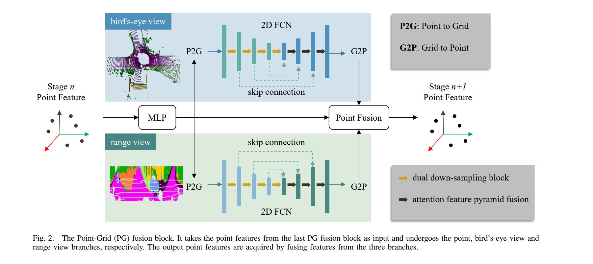

# ~~CPGNet: Cascade Point-Grid Fusion Network for Real-Time LiDAR Semantic Segmentation~~

- ~~This is **N**on-**O**fficial implementation of [CPGNet](https://arxiv.org/abs/2204.09914).~~ Just a simple try and just simple reproduction based on [SMVF](https://github.com/GangZhang842/SMVF). :joy::joy::joy:
- Here is the official [Repo](https://github.com/GangZhang842/CPGNet).

## New Fix:
- Remove transformation consistency loss due to its large training burden. (~2X GPU memory consumption & ~2X training time boost)
- CutMiX data augmentation now available.
- CosineAnnealingWarmUpRestarts look better than StepLR.
- Now, there is not much performance gap between wce and ohem.

## Environment Setup
Please refer to [SMVF](https://github.com/GangZhang842/SMVF) repo. ~~**Note:** Make sure deep_point is installed.~~
## Prepare Data
Download SemanticKITTI from [official web](http://www.semantic-kitti.org/dataset.html). 
Download Object_Bank from [SMVF](https://github.com/GangZhang842/SMVF) for CutMix.
## Training
~~~
### Multi-gpus ###
CUDA_VISIBLE_DEVICES=0,1 python -m torch.distributed.launch --nproc_per_node=2 train.py --config config/wce.py

### Single-gpu ###
CUDA_VISIBLE_DEVICES=0 python -m torch.distributed.launch --nproc_per_node=1 train.py --config config/wce.py
~~~

## Evaluation
~~~
CUDA_VISIBLE_DEVICES=0 python -m torch.distributed.launch --nproc_per_node=1 evaluate.py --config config/wce.py --start_epoch 0 --end_epoch 47
~~~

## Find best epoch
~~~
python find_best_metric.py --config wce.py
~~~

## Pretrained Models and Logs
Models have been uploaded to this [Google Drive folder](https://drive.google.com/drive/folders/18DsT-int3XuNRmQ1W0FkNnZ3PaGRohpn?usp=sharing).

| CPGNet | Loss | Batch_Size * GPUS | mIoU |
| :---------------: | :---------------: | :---------------: | :---------------: |
| Our Reproduced | WCE (stage=1 w/o CutMix) |      6 * 2 (FP16 on 3090)       |       58.6        |
| Our Reproduced | WCE (stage=1) |      6 * 2 (FP16 on 3090)       |       62.4        |
| Our Reproduced | WCE (stage=2) |      6 * 2 (FP16 on 3090)       |       64.9        |
| Paper Reported | WCE (stage=1) |       ~~2 * 8 (FP32 on 2080ti)~~     |       **62.5**        |
| Paper Reported | WCE (stage=2) |       ~~2 * 8 (FP32 on 2080ti)~~     |       **65.9**        |

**Note:** 
- Our model is trained using 1/4 of the data. See [here of code](https://github.com/huixiancheng/No-CPGNet/blob/main/datasets/data.py#L91).
- We did not use TTA, which actually slightly improved performance by about 1.0%. If want to enable it, comment [here](https://github.com/huixiancheng/No-CPGNet/blob/main/evaluate.py#L34-L35) and [here](https://github.com/huixiancheng/No-CPGNet/blob/main/datasets/data.py#L268-L269).

Below are known issues listed:
- Over-fitting on the validation set, the model with 64.9mIoU on the validation set achieved only 61.8mIoU on the CodaLab online test set. (Probably because we only use 1/4 of the data for training)

## Citation
It should be considered to cite:
~~~
@inproceedings{li2022cpgnet,
  title={CPGNet: Cascade Point-Grid Fusion Network for Real-Time LiDAR Semantic Segmentation},
  author={Li, Xiaoyan and Zhang, Gang and Pan, Hongyu and Wang, Zhenhua},
  booktitle={2022 IEEE International Conference on Robotics and Automation (ICRA)},
  year={2022},
  organization={IEEE}
}
~~~